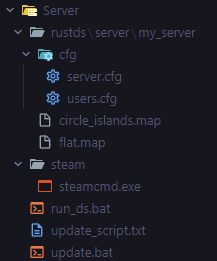
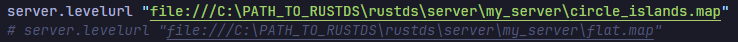
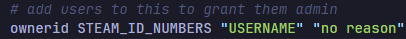
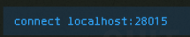
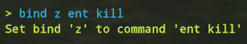
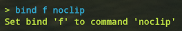
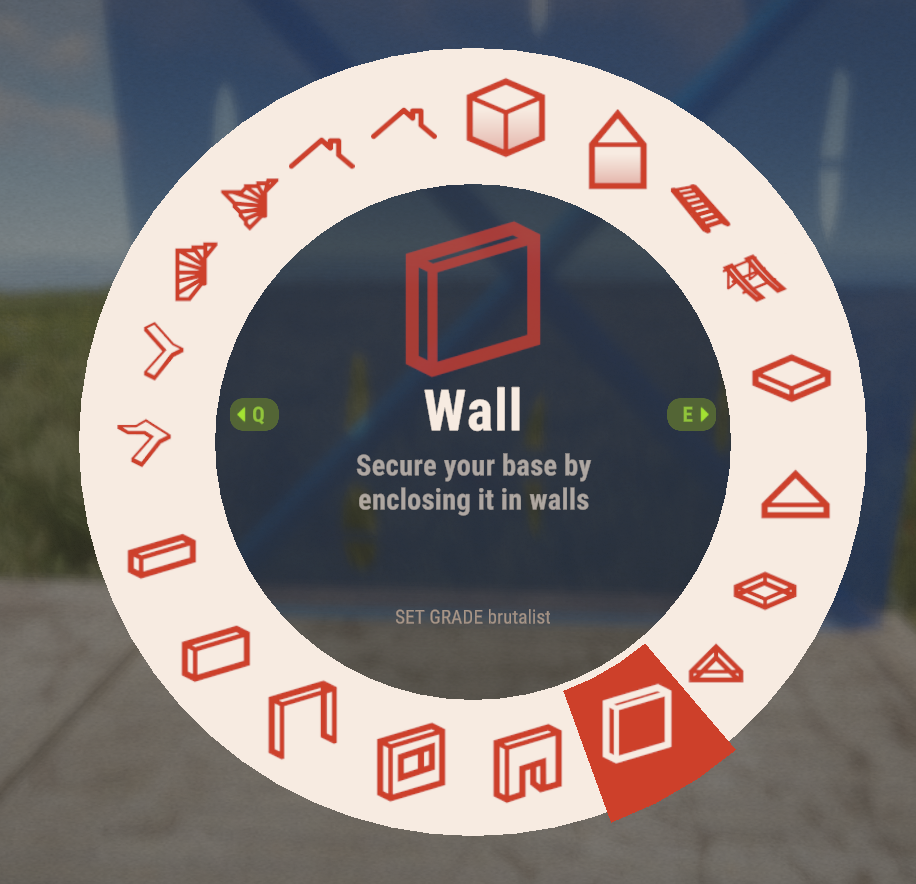
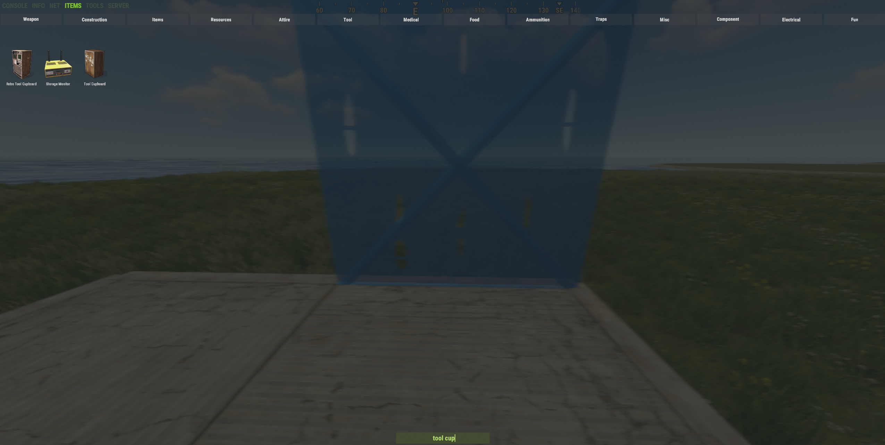
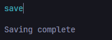
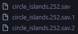

## Facepunch Rust Private Creative Build Server

## Table of Contents

- [About](#about)
- [Recommendations \& Alternatives](#recommendations--alternatives)
    - [Build Servers](#build-servers)
    - [Fortify - Rust Base Designer](#fortify---rust-base-designer)
- [Tutorial](#tutorial)
  - [Running Server](#running-server)
  - [Connecting to Server](#connecting-to-server)
  - [Stopping Server](#stopping-server)
  - [Recommended Binds](#recommended-binds)
  - [Other Information](#other-information)
    - [Godmode](#godmode)
    - [Time](#time)
    - [Building Grade](#building-grade)
    - [Spawing Anything](#spawing-anything)
    - [Saving](#saving)
- [Tools \& Links](#tools--links)
    - [Rust Edit](#rust-edit)
    - [Commands](#commands)
- [Updates](#updates)

# About

This is a proof of concept for a mod free and self hosted private build server.  
It uses the recently added `creative` commands; as well as a couple custom maps that give plenty of room for experimenting with different builds and concepts.  
The zip for this project comes from the [Rust Wiki](https://wiki.facepunch.com/rust/Creating-a-server) regarding servers.  

# Recommendations & Alternatives

It is important to acknowledge that this isn't for everyone and there are already great ways to practice building in a variety of ways.  
These are superior because they have great tooling for being creative and UX, such as symmetry and saving/loading designs.  

### Build Servers

- [Builder's Sanctuary](https://store.builderssanctuary.com/)
- [UKN](https://ukn.gg/)
  
### Fortify - Rust Base Designer

- [Steam Page](https://store.steampowered.com/app/505040/FORTIFY/)

This POC exists as a standalone from these for a few reasons:  
1. Build servers can be extremely laggy and getting kicked is not uncommon.
2. Fortify is a fantastic tool, but lacks the sense of feeling and scale from seeing a design in game.
3. Both Fortify and sandbox servers can come with a pricetag, so this is a free alternative.

# Tutorial

To begin, download the server.zip from the [Releases](https://github.com/smithcol11/playrust_creative_server/releases), this contains all the necessary files and configs needed.

## Running Server

Getting a server started will be pretty easy, as some maps are provided and the config files are written in a way that makes sense for what we want.  

Simply unarchive the project to reveal the strucute:  

Before running anything, there are two files that need to be modified to fit you. These being `server.cfg` and `users.cfg`.  
In `server.cfg`, change the path to the `.map` files to their respective locations in your file system.  

  

In `users.cfg`, add your respective information from Steam to be added as an admin.

Now that we have done that, we can simply run `run_ds.bat`.  
This will download the rust server, keep it up to date, and use the configs we set.  
Once this is done, we can connect from our Rust client.

## Connecting to Server

Open Rust, and press `F1` to open the console. Here we will type `connect localhost:28015`  
This will connect us to our locally hosted server on port 28015. `connect` should resolve to `client.connect`.  

Keep in mind, we have not exosed this port to the outside internet. No one will be able to connect to this except for those on the local network.  This means we keep unwanted individuals out, but no friends can join either. If you wanted to allow friends to join, you would have to forward this port on your router and not set the `server.levelurl` to be a file. But that is beyond the scope of this POC.   

To disconnect, you can open the console again, and type `disconnect`, which maps to `client.disconnect`.

## Stopping Server

This is pretty easy, you just have to press `ctrl` + `c` in the console that started the server.  
It will then prompt you to terminate the batch job, to which you type `y` and press enter.

## Recommended Binds

There are two really useful commands you will want to bind to hotkeys while building.  
These being `noclip` and `ent kill`.  
`noclip` enables flight and going through objects.  
`ent kill` is basically a "remove" for whatever entity you are looking at.

Here are examples of binds you could set:  
`bind z ent kill`  & `bind f noclip`  

`Z` isn't bound to anything and is easy to reach, so it seemed like a good choice.  
`F` is bound to flashlight/laser, but other builds servers use it to enable noclip so it seemed fitting.  
Feel free to set these to be whatever you want.  

## Other Information

### Godmode

There is a config value `global.god` that should be set to 'True'.  
It will prevent you from taking damage and needing to eat/drink.  
If it isn't working at first, press `F1` in game, and type `global.god True` in the console;

### Time

There is a config value `global.admintime` that should set the time statically to noon. But this may not work, or you may want to change it.  
Simply press `F1` in game, and type `admintime n` in the console; `-1 <= n <= 24`

### Building Grade

While using the building plan, you can set the grade of what you place by using `Q` and `E`.  

### Spawing Anything

You will likely want to spawn objects and items to place around your base or use.  
A good flow for this is to press `F1` then `Tab`, which will bring you to the "Items" tab. Admins can spawn anything in from here.  
You will also notice that your cursor is automatically placed on the search bar, so you can begin typing what you want. In this example, a tool cupboard.  

Close this by pressing `F1` again or `Esc`.

### Saving

The server will auto save every so often. But it you want to ensure a save happens right before you stop the server, type `save` into the console that is running `run_ds.bat`.

Save files will appear inside of the `my_server` folder. Deleting them will wipe your work, so be sure you have backups or are intentially wanting to remove these.  

# Tools & Links

### Rust Edit

If you're wanting to know how I created the `.map` files, or you want to create some of your own, check out [Rust Edit](https://www.rustedit.io/).  
The website is pretty bare bones, but the tool is great and pretty intuitive to figure out.

### Commands

[Useful Console Commands](https://wiki.facepunch.com/rust/useful_commands) - Rust Wiki  
[Admin Commands](https://www.corrosionhour.com/rust-admin-commands/) - Corrosion Hour

# Updates

I will update this if problems are found, better configs are needed, or new maps are desired, etc.

I have thought about writing some plugins for [Oxide](https://umod.org/games/rust) that would provide similar tools to Builder's Sanctuary or UKN Sandbox, but that is a lot of work and I am unsure if anyone would even be interested in that. So for now I will leave it as this and if people are wanting this I can look into it!

Cheers